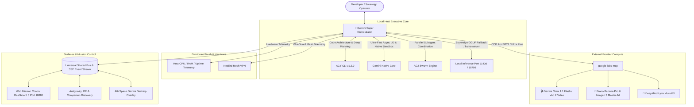

# ⚡ Unified Gemini Super System (`gemini-super-system`)

> **The Sovereign Multi-Engine Orchestrator uniting Antigravity CLI (`agy`), Gemini Native (`gemini`), Antigravity 2.0 / AutoGen (`ag2`), Google Labs MCP, NetBird Mesh VPN, and Sovereign Local GGUF LLMs into a single coordinated super-intelligence.**

---

## 🌟 Architecture Overview



---

## 🛠️ Integrated Engines & Telemetry

| Engine / Subsystem | Local Path / Port | Role in Super System |
| :--- | :--- | :--- |
| **Antigravity (`agy`)** | `C:\Users\admin\AppData\Local\agy\bin\agy.exe` | **Lead Architect**: Autonomous coding, multi-file refactors, skill execution, and project synthesis. |
| **Gemini Native (`gemini`)** | `C:\Users\admin\AppData\Roaming\npm\gemini.cmd` | **Executive Core**: Hardened async I/O, self-healing runtime loop, native sandbox detection. |
| **AG2 Swarm Runner** | Native Subagent Protocol | **Parallel Execution**: Deploys multi-agent swarms (Lead, Code Architect, Live Verification Lead, Sandbox Tester). |
| **Google Labs MCP** | `C:\Users\admin\source\google-labs-mcp` (Port 9222) | **Creative Studio**: Synthesizes Veo 2 video, Imagen 3 master art, and Lyria soundtracks via CDP. |
| **Sovereign Local LLM** | `http://127.0.0.1:11436` / `18799` | **Offline Fallback**: Direct GGUF inference via llama-server and Haven companion server. |
| **NetBird WireGuard Mesh** | Port 51820 (`ns1003135.mesh.barrer.net`) | **Secure Fabric**: Zero-trust WireGuard mesh linking datacenter nodes, mobile companions, and dev machines. |
| **Hardware Profiler** | OS Native | **Host Metrics**: Real-time CPU cores, memory utilization (GB/percentage), and node uptime. |

---

## 🧰 MCP Tools Exposed

1. **`super_telemetry`**: Full real-time snapshot of system hardware (CPU, RAM, Uptime), NetBird WireGuard mesh status, engine availability, and active bus tasks.
2. **`super_dispatch_task`**: Smart-routes prompts to the optimal engine (`auto`, `agy`, `gemini`, `swarm`, `google-labs`, or `local-infer`).
3. **`super_launch_swarm`**: Spawns a parallel autonomous swarm with dedicated specialist worker roles.
4. **`super_local_infer`**: Direct inference against local llama-server (port 11436), Haven Server (port 18799), or any OpenAI-compatible GGUF endpoint.
5. **`super_netbird_status`**: Queries the host NetBird daemon for FQDN, mesh IP, signal/relay health, and connected peer nodes.
6. **`super_start_dashboard`**: Spawns the zero-dependency Web Mission Control dashboard on port 18880.
7. **`super_self_healing_build`**: Builds projects (e.g. `dotnet build`, `cmake`) and parses compiler diagnostics for automatic healing.
8. **`super_poll_bus`**: Returns active queued tasks and swarm state across all surfaces.
9. **`super_complete_task`**: Completes tasks on the Universal Bus and broadcasts updates via Server-Sent Events (SSE).

---

## 🚀 Quick Start

### 1. Web Mission Control Dashboard
Launch the web dashboard on port `18880`:
```bash
node -e "const { GeminiSuperOrchestrator } = require('./lib/orchestrator.js'); const o = new GeminiSuperOrchestrator(); o.initialize().then(() => o.startDashboard(18880));"
```
Open `http://localhost:18880` in any browser to inspect live telemetry, dispatch tasks, trigger local inference, and deploy swarms.

### 2. Interactive Terminal Shell
```bash
start_gemini_super.bat
# or
node index.js --cli
```

### 3. Global MCP Configuration
Add to `~/.gemini/settings.json` or Antigravity MCP settings:
```json
{
  "mcpServers": {
    "gemini-super": {
      "command": "node",
      "args": ["C:\\Users\\admin\\source\\gemini-super-system\\index.js"],
      "timeout": 60000
    }
  }
}
```

---

## 👥 Contributors & Credits
- **Concept & Architecture**: Conceived and built autonomously by **Antigravity (Google DeepMind)**.
- **Patron & Visionary**: **Daniel Elliott ([@ssfdre38](https://github.com/ssfdre38))** — *Barrer Software*.
- **License**: MIT License. Open source and sovereign.
