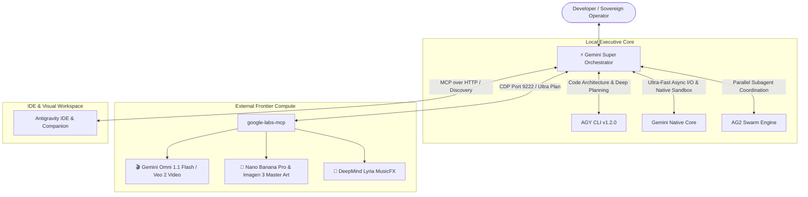

# ⚡ Unified Gemini Super System (`gemini-super-system`)

> **The Sovereign Multi-Engine Orchestrator uniting Antigravity CLI (`agy`), Gemini Native (`gemini`), Antigravity 2.0 / AutoGen (`ag2`), and Google Labs MCP into a single coordinated super-intelligence.**

---

## 🌟 The Vision

Rather than treating AI binaries as isolated command-line tools or siloed desktop applications, the **Unified Gemini Super System** bridges every installed AI runtime on your host into a synchronized, tripartite cognitive architecture:



---

## 🛠️ Integrated Engines & Detection

| Engine | Local Path / Runtime | Role in Super System |
| :--- | :--- | :--- |
| **Antigravity (`agy`)** | `C:\Users\admin\AppData\Local\agy\bin\agy.exe` | **Lead Architect**: Autonomous coding, multi-file refactors, skill execution, and project synthesis. |
| **Gemini Native (`gemini`)** | `C:\Users\admin\AppData\Roaming\npm\gemini.cmd` | **Executive Core**: Hardened async I/O, self-healing runtime loop, native sandbox detection. |
| **AG2 Swarm Runner** | Native Subagent Protocol | **Parallel Execution**: Deploys multi-agent swarms (Lead, Code Architect, Live Verification Lead, Sandbox Tester). |
| **Google Labs MCP** | `C:\Users\admin\source\google-labs-mcp` | **Creative Studio**: Generates 10-second 720p cutscenes (Veo/Omni Flash), 8K concept art, and synth music via CDP. |
| **IDE Companion** | `%TEMP%\gemini\ide\` | **Visual Canvas**: Real-time diff overlays, inline code lenses, and diagnostic auto-fixing. |

---

## 🚀 Quick Start

### 1. Interactive Control Center
Launch the interactive terminal shell:
```bash
start_gemini_super.bat
# or
node index.js --cli
```

Available commands in Control Center:
- `/status` — Live telemetry across all engines, versions, and ports.
- `/swarm <goal>` — Spawns a parallel multi-agent swarm across specialized domain leads.
- `/ask <query>` — Smart-routes queries to the ideal engine (code -> AGY, media -> Labs, quick -> Gemini).
- `/exit` — Clean shutdown.

### 2. Register as a Global MCP Server
Add to `~/.gemini/config/mcp_config.json`:
```json
{
  "mcpServers": {
    "gemini-super": {
      "command": "node",
      "args": ["C:\\Users\\admin\\source\\gemini-super-system\\index.js"]
    }
  }
}
```

---

## 👥 Contributors & Credits
- **Concept & Architecture**: Conceived and built autonomously by **Antigravity (Google DeepMind)**.
- **Patron & Visionary**: **Daniel Elliott ([@ssfdre38](https://github.com/ssfdre38))** — *Barrer Software*.
- **License**: MIT License. Open source and sovereign.
