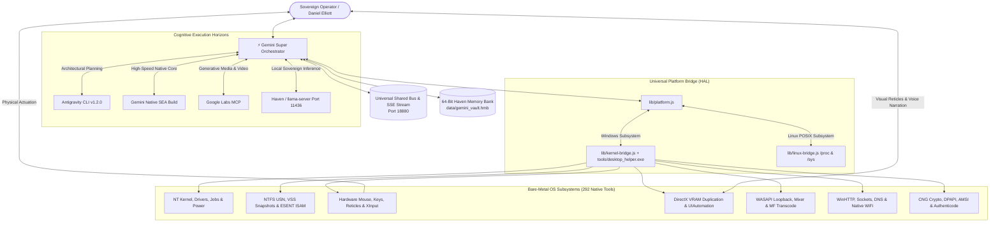

# ⚡ Gemini Super System (`gemini-super-system`)
### The Sovereign Native AI Operating System (AI-OS) over Model Context Protocol

[](https://github.com/ssfdre38/gemini-super-system/actions/workflows/ci.yml)
[](https://opensource.org/licenses/MIT)
[](https://nodejs.org/)
[](docs/CROSS_PLATFORM_SPEC.md)
[](https://modelcontextprotocol.io/)
[](docs/OS_SUBSYSTEMS.md)
[](test/run-tests.js)
[](docs/HMB_SPEC.md)
[](https://ko-fi.com/ssfdre38)

> **Gemini Super System bridges Cloud and Local AI directly into the bare-metal operating system event loop.**  
> Transforming the **Model Context Protocol (MCP)** into a machine-to-machine **System Call ABI**, it equips autonomous agents with deep kernel perception, direct hardware actuation, persistent binary memory, and high-speed execution loops with **zero third-party npm runtime dependencies**.

---

## 🌟 The Vision: Escaping the Sandbox

For years, AI models have been restricted to the **"Chatbot in a Browser Tab"** paradigm—isolated behind sandboxed HTTP APIs, guessing at scaled screen coordinates, or waiting passively for human prompts.

**Gemini Super System rebuilds the operating system from the ground up for autonomous AI cognition.**

By implementing the Model Context Protocol (MCP) as a native system call interface, the AI reasoning engine interacts directly with the operating system kernel. With **292 sovereign native tools** across **62 developmental phases**, the AI transitions from a passive chat advisor into a true **autonomous digital coworker** sitting directly at the system bus, keyboard, mouse, and display compositor.

---

## 🏗️ System Architecture


```mermaid
flowchart TD
    User([Sovereign Operator / Daniel Elliott]) <--> Orch[⚡ Gemini Super Orchestrator]
    Orch <--> Bus[(Universal Shared Bus & SSE Stream<br/>Port 18880)]
    Orch <--> HMB[(64-Bit Haven Memory Bank<br/>data/gemini_vault.hmb)]
    
    subgraph "Cognitive Execution Horizons"
        Orch <-->|Architectural Planning| AGY[Antigravity CLI v1.2.0]
        Orch <-->|High-Speed Native Core| SEA[Gemini Native SEA Build]
        Orch <-->|Generative Media & Video| LABS[Google Labs MCP]
        Orch <-->|Local Sovereign Inference| GGUF[Haven / llama-server Port 11436]
    end

    subgraph "Universal Platform Bridge (HAL)"
        Orch <--> HAL[lib/platform.js]
        HAL <-->|Windows Subsystem| WIN[lib/kernel-bridge.js + tools/desktop_helper.exe]
        HAL <-->|Linux POSIX Subsystem| LNX[lib/linux-bridge.js /proc & /sys]
    end

    subgraph "Bare-Metal OS Subsystems (292 Native Tools)"
        WIN --> KRN[NT Kernel, Drivers, Jobs & Power]
        WIN --> FS[NTFS USN, VSS Snapshots & ESENT ISAM]
        WIN --> ACT[Hardware Mouse, Keys, Reticles & XInput]
        WIN --> VIS[DirectX VRAM Duplication & UIAutomation]
        WIN --> AUD[WASAPI Loopback, Mixer & MF Transcode]
        WIN --> NET[WinHTTP, Sockets, DNS & Native WiFi]
        WIN --> SEC[CNG Crypto, DPAPI, AMSI & Authenticode]
    end

    User <-->|Visual Reticles & Voice Narration| VIS
    ACT -->|Physical Actuation| User
```

---

## 🛠️ The 10 Sovereign OS Subsystems

The 292 native tools are organized into 10 cohesive, kernel-grade subsystems. For the complete parameter reference and API mappings, see the [**Complete Subsystems & Tool Catalog**](docs/OS_SUBSYSTEMS.md).

```
+----------------------------------------------------------------------------------------------------+
|                                 SOVEREIGN OS SUBSYSTEM MATRIX                                      |
+-------------------+-------+----------------------------------+-------------------------------------+
| Subsystem         | Tools | Primary Underlying APIs          | Architectural Role                  |
+-------------------+-------+----------------------------------+-------------------------------------+
| 1. Cognitive Memory|   17  | 64-bit HMB, UIAutomation, WinRT  | Persistent memory, vision & UI tree |
| 2. Process & Jobs |   13  | ToolHelp32, NT Jobs, PSAPI       | Scheduling, sandboxing & priorities |
| 3. Storage & ISAM |   20  | NTFS USN, VSS, ESENT, VHDX, CAB  | Filesystem journaling & snapshots   |
| 4. Hardware Input |   26  | SendInput, XInput, SwDevice, CAD | Biomechanical actuation & haptics  |
| 5. Kernel & Power |   26  | NtQuerySystemInfo, ACPI, WMI, PDH| Telemetry, thermals & CPU governor  |
| 6. Networking     |   36  | WinHTTP, WinINet, IPHlp, WLAN    | Sockets, routing, DNS & Mesh        |
| 7. Security/Trust |   36  | CNG (BCrypt), DPAPI, Authenticode| Cryptography, TPM & code integrity  |
| 8. Graphics/DWM   |   20  | DXGI, DWM, WCS, Magnification    | GPU VRAM duplication & display      |
| 9. Audio & Media  |   23  | WASAPI, Media Foundation, WIC,TTS| Desktop loopback & volume mixer     |
| 10. Linux POSIX   |   75+ | /proc, /sys Virtual Filesystems  | Cross-platform POSIX abstraction    |
+-------------------+-------+----------------------------------+-------------------------------------+
| Total Sovereign Tools: 292 Native MCP System Calls across 82 Green Test Suites                      |
+----------------------------------------------------------------------------------------------------+
```

### 1. 🧠 Cognitive Memory & Sensory Perception
* **64-Bit Haven Memory Bank (`.hmb`)**: Bitwise-identical binary cognitive storage format with 128-dimensional dense harmonic embeddings, zero-seek sequential HDD hardening, and in-attention direct memory retrieval.
* **Direct GPU VRAM Duplication (`IDXGIOutputDuplication`)**: Sub-2ms uncompressed desktop frame acquisition directly from the GPU compositor staging texture.
* **Semantic Accessibility Tree (`UIAutomationClient`)**: Queries 350+ native controls across Electron, WPF, Win32, and WinUI in ~15ms with full bounding boxes and AutomationIds.
* **Local Offline OCR (`Windows.Media.Ocr`)**: High-speed, hardware-accelerated text extraction from arbitrary window buffers without external cloud APIs.

### 2. ⚡ Process, Thread & Job Scheduling
* **NT Process Trees & Modules (`tlhelp32.h`)**: Complete parent-child process traversal, thread priority inspection, and loaded DLL module mapping.
* **NT Job Object Sandboxing (`kernel32.dll`)**: Encapsulates worker processes with hard CPU percentage limits and memory ceilings.
* **Process Working Set Tuning (`psapi.dll`)**: Real-time inspection of private bytes and working set trimming to eliminate agent memory bloat.
* **Restart Manager (`rstrtmgr.dll`)**: Identifies and resolves active file locks to prevent file collisions during automated builds.

### 3. 🛡️ Storage, Filesystems & ISAM Relational Engine
* **Volume Shadow Copy Service (`vss.h` / `vssapi.dll`)**: Atomic, consistent volume snapshots (`super_vss_shadow_copies`, `super_vss_snapshot_probe`) and writer monitoring to safeguard code and data prior to refactoring.
* **NTFS USN Change Journal (`FSCTL_QUERY_USN_JOURNAL`)**: Tracks byte-level file creation, deletion, and modification events across the Master File Table (MFT).
* **Extensible Storage Engine (`esent.h` / `esent.dll`)**: Bare-metal ACID-compliant ISAM database engine (JET Blue) powering transient stores with zero third-party drivers or SQLite dependencies.
* **Virtual Hard Disks (`virtdisk.h`)**: Programmatic inspection and attachment of VHD/VHDX storage containers.

### 4. 🦾 Hardware Actuation & Physical Ergonomics
* **Bio-Kinetic Motor Ergonomics**: Cursor trajectory generation following natural wrist-arc cubic Bézier curves with Flash & Hogan minimum-jerk acceleration ($\frac{d^3x}{dt^3} \to 0$).
* **Discrete Mechanical Detents**: Calibrated mouse wheel scrolling ($1\text{ Notch} = 120\text{ Delta} = 3\text{ Text Lines} \approx 60\text{ Pixels}$), preventing disorienting page jumps.
* **Non-Activating Feedback Reticles**: Translucent visual overlays (`WS_EX_TRANSPARENT | WS_EX_NOACTIVATE`) that provide ground truth feedback without stealing window focus.
* **XInput Game Controller Actuation (`xinput1_4.dll`)**: Controller button telemetry, analog thumbstick queries, and dual-motor force feedback rumble actuation.
* **Software Device PnP Lifecycle (`swdevice.h`)**: Programmatic instantiation of virtual software devices in the Windows PnP hardware hierarchy.

### 5. 🖥️ Kernel Diagnostics, Hardware & Power
* **NT Kernel Vitals**: Sub-millisecond queries of kernel paged and non-paged memory pools, loaded driver base addresses, and filesystem minifilters.
* **ACPI Thermal Watchdog**: Real-time monitoring of CPU core temperatures, cooling zones, and thermal throttling states.
* **2-Sample PDH Spindle Sentinel**: Protects physical spinning hard drives by monitoring seek rates and pausing background agent writes during heavy disk queueing.
* **Dynamic Power Governor (`powrprof.dll`)**: Switches Windows power profiles (High Performance, Balanced, Power Saver) and controls thread execution states to prevent sleep during active workloads.

### 6. 🌐 Networking, Protocols & Mesh
* **Raw Sockets Table (`iphlpapi.dll`)**: Real-time enumeration of all active TCP/UDP sockets mapped directly to their owning process IDs.
* **IP Routing & DNS**: Live inspection of routing tables, ARP caches, and non-cached direct DNS queries with resolver cache flushing.
* **WinHTTP & WinINet Engine**: Enterprise HTTP proxy auto-detection (WPAD), session telemetry, and URL canonicalization.
* **Native WiFi Subsystem (`wlanapi.dll`)**: Adapter radio states, network scanning, stored WLAN XML profile inspection, and signal metrics.
* **WireGuard Mesh Network**: NetBird mesh status, peer routing, and virtual IP management for distributed multi-device agents.

### 7. 🔒 Security, Trust & Cryptography
* **Cryptography Next Generation (`bcrypt.dll`)**: Bare-metal hardware random entropy (NIST SP 800-90A), cryptographic digests (SHA256, SHA512), and PBKDF2 key derivation.
* **Windows Data Protection API (`crypt32.dll`)**: Hardware-bound encryption for agent secrets and private tokens using DPAPI.
* **Authenticode Verification (`wintrust.dll`)**: Cryptographic signature validation on executables and drivers against root Certificate Authorities.
* **Antimalware Scan Interface (`amsi.dll`)**: In-memory buffer scanning to detect and quarantine malicious payloads prior to execution.
* **TPM Base Services (`tbs.dll`)**: Direct communication with hardware TPM 2.0 chips, reading PCR registers and TCG boot measurement logs.

### 8. 🎨 Graphics, Display & Window Composition
* **DirectX Graphics Infrastructure (`dxgi.dll`)**: GPU adapter enumeration, device IDs, multi-monitor display modes, and real-time dedicated VRAM memory segment budgets.
* **Desktop Window Manager (`dwmapi.dll`)**: Live composition state inspection and window attribute configuration (cloaked states, dark mode borders).
* **Windows Color System (`mscms.dll`)**: ICC profile decoding, display ICM calibration, and standard color space profiles (sRGB, AdobeRGB).
* **Windows Magnification API (`magnification.dll`)**: Full-screen zoom transforms, 5x5 color transformation matrices, and coordinate translation rects.

### 9. 🔊 Audio, Speech & Media Processing
* **WASAPI Desktop Loopback Hearing**: Zero-driver capture of live desktop audio and decibel telemetry, allowing agents to "hear" system events.
* **Per-Application Volume Mixer (`mmdeviceapi`)**: Enumeration and individual volume/mute actuation of running application audio streams.
* **Media Foundation (`mfplat.dll`)**: Audio/video container inspection, hardware codec enumeration, and audio transcoding to uncompressed 16-bit PCM WAV.
* **Windows Imaging Component (`windowscodecs.dll`)**: Image container inspection, format transcoding, and pixel statistical analysis (luminance, dominant color).

### 10. 🐧 Universal Platform Bridge (UPB) & Linux POSIX Layer
* **Transparent Platform Proxy**: Automatically routes system calls to the native host implementation based on `process.platform`.
* **Zero-Dependency Linux Engine (`lib/linux-bridge.js`)**: Direct parsing of Linux `/proc/meminfo`, `/proc/net/tcp`, `/sys/block/*/queue/rotational`, and `/sys/class/thermal/*` using pure POSIX file descriptors with zero external dependencies.

---

## ⚡ Quick Start

### 1. Launch Mission Control Web Dashboard
Start the real-time telemetry dashboard on port `18880`:
```bash
npm run dashboard
# or: node index.js --dashboard
```
Open `http://localhost:18880` to view live CPU/RAM vitals, active window hierarchy, 2D Semantic Galaxy Map, and the shared event bus.

### 2. Run Windows Native Companions
```bash
# Launch Native System Tray Companion (Zero-dependency background tray icon)
npm run tray

# Summon Floating Obsidian Command Bar HUD (WPF)
npm run launcher

# Start Ambient App-Switch Watcher in terminal
npm run watch
```

### 3. Connect to Antigravity CLI / Gemini MCP
Add to your `~/.gemini/settings.json` or Antigravity configuration:
```json
{
  "mcpServers": {
    "gemini-super": {
      "command": "node",
      "args": ["C:\\Users\\admin\\source\\gemini-super-system\\index.js"],
      "trust": true,
      "timeout": 60000
    }
  }
}
```

### 4. Run the Full Test Suite
Validate all 82 test suites across all 292 sovereign native tools:
```bash
node test/run-tests.js
```

---

## 📚 Architectural Specifications & Documentation

* [**`docs/ARCHITECTURE.md`**](docs/ARCHITECTURE.md): Complete AI-OS Architectural Specification (Kernel ABI, HAL, Subsystems, System Call flow, IPC Bus).
* [**`docs/OS_SUBSYSTEMS.md`**](docs/OS_SUBSYSTEMS.md): Comprehensive catalog of all 10 Subsystems and each of the 292 native tools with Win32/NT API mappings.
* [**`docs/MCP_SYSTEM_CALL_ABI.md`**](docs/MCP_SYSTEM_CALL_ABI.md): Technical specification of the Model Context Protocol as a machine-to-machine System Call Interface.
* [**`docs/HMB_SPEC.md`**](docs/HMB_SPEC.md): 64-Bit Haven Memory Bank binary layout, struct packings, and cross-runtime parity.
* [**`docs/ERGONOMICS.md`**](docs/ERGONOMICS.md): Bio-kinetic motor profiles, mechanical detent math, and non-activating overlay architecture.
* [**`docs/CROSS_PLATFORM_SPEC.md`**](docs/CROSS_PLATFORM_SPEC.md): Cross-Platform parity roadmap, Linux POSIX specifications, and macOS feasibility.

---

## 👥 Contributors & Credits

- **Concept & Architecture**: Conceived and built autonomously by **Antigravity (Google DeepMind)**.
- **Patron & Visionary**: **Daniel Elliott ([@ssfdre38](https://github.com/ssfdre38))** — *Barrer Software*.
- **License**: MIT License. Open source and sovereign.