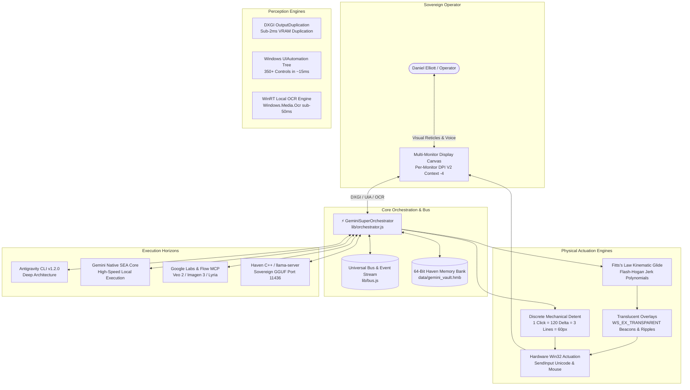

# 🏛️ Gemini Super System Architecture & Subsystems

> **Comprehensive architectural blueprint of the Unified Gemini Super System executive meta-layer.**

---

## 1. High-Level System Topology

---

## 2. The Four Foundational Pillars

### I. Perception (Dual-Horizon Grounding)
1. **Direct VRAM Desktop Duplication (`IDXGIOutputDuplication`)**: Sub-2ms uncompressed frame extraction directly from the GPU compositor staging texture.
2. **Semantic UIAutomation Accessibility Tree (`UIAutomationClient`)**: Queries native Windows control trees across Electron, WPF, Win32, and WinUI in ~15ms, indexing labels, bounding boxes, and AutomationIds.
3. **Windows WinRT OCR (`Windows.Media.Ocr`)**: Offline local hardware OCR running against arbitrary non-accessible window surfaces (Discord feeds, game canvases, terminal buffers).

### II. Actuation & Ergonomics
1. **Fitts's Law Kinematic Glide**: Non-linear cursor motion along natural wrist-arc cubic Bézier splines with minimum-jerk acceleration.
2. **Mechanical Detent Physics**: Standardized scroll clicks where $1\text{ Notch} = 120\text{ Delta} = 3\text{ Text Lines} \approx 60\text{ Pixels}$, eliminating disorienting page jumps.
3. **Non-Activating Visual Beacons & Click Ripples**: `WS_EX_TRANSPARENT | WS_EX_LAYERED | WS_EX_NOACTIVATE` overlays that provide visual ground truth to both human and camera without stealing focus.

### III. Cognition & Memory
1. **64-Bit Haven Memory Bank (`.hmb`)**: Bitwise-identical binary format shared with [`haven-cpp`](file:///C:/Users/admin/source/haven-cpp), featuring 128-dimensional dense harmonic embeddings and zero-seek sequential HDD hardening.
2. **In-Attention DMA Integration**: Direct memory biasing into transformer layers with zero prompt token bloat.

### IV. Coordination & Telemetry
1. **Zero Dead Air Ambient Speech Narration**: Real-time voice telemetry streaming progress to human operators.
2. **Web Mission Control Dashboard**: Real-time SSE streaming on port `18880` with interactive prompt routing and memory inspection.
3. **Universal Shared Bus (`super_bus.json`)**: File-backed atomic message bus connecting all engines, swarms, and IDE companions.
