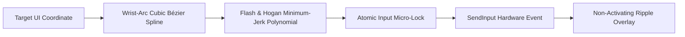

# 🏛️ Sovereign AI Operating System Architecture Specification
> **System Architecture, Kernel Call ABI, Subsystem Topology, and Platform Abstraction of the Unified Gemini Super System (`gemini-super-system`)**

---

## 1. Executive Summary & Core Philosophy

For decades, operating systems have been architected around human interaction paradigms: graphical window managers, physical mice, tactile keyboards, and visual display rasterizers. Conversely, contemporary Artificial Intelligence agents have been marooned inside artificial sandboxes: constrained within isolated browser tabs, restricted to high-latency HTTP APIs, or forced to guess at screen coordinates through lossy vision-only screenshots.

**Gemini Super System fundamentally reimagines the Model Context Protocol (MCP) as a Sovereign AI Operating System (AI-OS).**

Instead of treating MCP as a collection of disjointed plugins, Gemini Super System implements MCP as an unmediated **System Call ABI (Application Binary Interface)**. The AI reasoning core acts as the Central Processing Unit, MCP acts as the machine-to-machine System Call Gateway, and the underlying native engine acts as the Kernel and Hardware Abstraction Layer (HAL).

```
+---------------------------------------------------------------------------+
|               COGNITIVE INTELLIGENCE & REASONING CORE                    |
|        (Google Gemini 2.5 / Claude 3.7 / Antigravity CLI / AG2 Swarm)     |
+---------------------------------------------------------------------------+
                                     │
                          System Call Requests (MCP)
                                     ▼
+---------------------------------------------------------------------------+
|                 MCP SYSTEM CALL ABI (JSON-RPC 2.0)                        |
|           292 Sovereign Tools across 62 Developmental Phases              |
+---------------------------------------------------------------------------+
                                     │
                                     ▼
+---------------------------------------------------------------------------+
|              KERNEL SCHEDULER & ORCHESTRATION LAYER                       |
|   • GeminiSuperOrchestrator (lib/orchestrator.js)                         |
|   • Universal Shared Event Bus & SSE Daemon (lib/bus.js, port 18880)       |
|   • Autonomous Task Worker Pool (lib/worker-pool.js)                      |
|   • System Diagnostic Doctor (lib/doctor.js - 77 health checks)           |
+---------------------------------------------------------------------------+
                                     │
                                     ▼
+---------------------------------------------------------------------------+
|             UNIVERSAL PLATFORM BRIDGE & HAL (lib/platform.js)             |
|                                                                           |
|   ┌───────────────────────────────────┐ ┌─────────────────────────────┐   |
|   │     WINDOWS SUBSYSTEM (NT/Win32)  │ │   LINUX SUBSYSTEM (POSIX)   │   |
|   │  • tools/desktop_helper.exe (C#)  │ │   • lib/linux-bridge.js     │   |
|   │  • Win32 / NT Kernel P/Invoke     │ │   • /proc & /sys Telemetry  │   |
|   │  • COM / WMI / DirectX / WASAPI   │ │   • Zero-Dep POSIX Sockets  │   |
|   └───────────────────────────────────┘ └─────────────────────────────┘   |
+---------------------------------------------------------------------------+
                                     │
                                     ▼
+---------------------------------------------------------------------------+
|              HARDWARE, FILESYSTEM & COGNITIVE MEMORY SWAP                 |
|   • 64-Bit Haven Memory Bank (.hmb)       • DirectX GPU Duplication       |
|   • NTFS USN Journal / MFT Scanner        • Volume Shadow Copies (VSS)    |
|   • ESENT (JET Blue) ISAM Database        • Hardware Audio Loopback       |
|   • Physical Disk Sentinel (PDH)          • WireGuard Mesh (NetBird)      |
+---------------------------------------------------------------------------+
```

---

## 2. The Five Architectural Layers

### Layer 1: The Cognitive Core (Processor)
The AI model operates as the sovereign executive engine. It receives low-latency, highly structured telemetry from the underlying system, forms autonomous decisions through multi-step planning loops, and dispatches atomic system calls.

### Layer 2: MCP System Call ABI (Syscall Gateway)
Standard operating systems define system call numbers and register conventions (`int 0x80`, `syscall`, `sysenter`). Gemini Super System establishes a structured, JSON-RPC 2.0 system call interface over `stdio` and `SSE`:
- **Strict Typing**: All 292 system calls provide validated JSON Schemas.
- **Microsecond Latency**: Pure compiled native execution without spawning slow intermediate shells or PowerShell instances.
- **Atomic Operations**: Hardware actuation and kernel queries execute as atomic transactions.

### Layer 3: Kernel Scheduler & Orchestrator
The central coordinator (`GeminiSuperOrchestrator`) manages process dispatching, event bus publishing, multi-agent synchronization, and watchdog monitoring:
- **Shared Bus (`lib/bus.js`)**: An atomic, file-backed state bus supporting real-time streaming, frame-level task interruption, and prompt queues.
- **Worker Pool (`lib/worker-pool.js`)**: Manages background asynchronous task runners with strict concurrency ceilings and prioritization.
- **Diagnostic Doctor (`lib/doctor.js`)**: Validates 77 distinct hardware, driver, and kernel invariants prior to runtime actuation.

### Layer 4: Universal Platform Bridge (HAL)
The Hardware Abstraction Layer (`lib/platform.js`) decouples the AI reasoning layer from operating system specifics:
- **Windows Subsystem**: Direct Win32 and NT kernel integration via compiled 64-bit C# helper (`tools/desktop_helper.exe`), executing Win32 APIs, COM interfaces, and WMI queries.
- **Linux Subsystem**: Bare-metal `/proc` and `/sys` virtual filesystem parser (`lib/linux-bridge.js`) extracting RAM statistics, network socket tables, thermal zones, and block device metrics with zero third-party dependencies.

### Layer 5: Persistent Storage & Hardware Actuation
The physical execution layer providing ground-truth feedback:
- **Direct GPU Frame Duplication (`IDXGIOutputDuplication`)**: Sub-2ms uncompressed frame extraction directly from VRAM staging textures.
- **Semantic Accessibility Trees (`UIAutomationClient`)**: Traversal of 350+ UI elements in ~15ms with full bounding box and control pattern resolution.
- **64-Bit Binary Memory Bank (`.hmb`)**: Bitwise-identical persistent cognitive storage across C++, C#, and Node.js.

---

## 3. Cognitive Memory Architecture (HMB & Swap)

The AI-OS requires persistent memory that survives across process restarts, model context resets, and session boundaries. Gemini Super System implements the **Haven Memory Bank (`.hmb`)** specification:

```
+---------------------------------------------------------------------------+
|            64-BIT HAVEN MEMORY BANK (.hmb) BINARY LAYOUT                 |
+---------------------------------------------------------------------------+
| Header (32 bytes)                                                         |
|   • Magic: "HMB1" [0x48, 0x4D, 0x42, 0x31] (4 bytes)                      |
|   • Version: uint32 (4 bytes)                                             |
|   • Memory Count: uint64 (8 bytes)                                        |
|   • Reserved / Alignment Padding: 16 bytes                                |
+---------------------------------------------------------------------------+
| Memory Anchor Records (Repeated N times)                                  |
|   • Concept Hash: FNV-1a 64-bit uint64 (8 bytes)                          |
|   • Timestamp: ISO-8601 millisecond uint64 (8 bytes)                      |
|   • Valence / Emotional Weight: float32 (4 bytes)                         |
|   • Arousal / Urgency Weight: float32 (4 bytes)                           |
|   • Dense Harmonic Embedding: 128 x float32 unit vector (512 bytes)       |
|   • Concept String Length: uint16 (2 bytes)                               |
|   • Concept UTF-8 String Bytes (Variable)                                 |
|   • Context String Length: uint32 (4 bytes)                               |
|   • Context UTF-8 String Bytes (Variable)                                 |
+---------------------------------------------------------------------------+
```

### In-Attention Direct Memory Access (DMA)
Rather than wasting thousands of context tokens concatenating raw text history, the cognitive memory engine computes normalized 128-dimensional dense harmonic embeddings and cosine similarity metrics. High-scoring anchors are injected directly into the active prompt context with minimal token overhead.

### Spindle Guardian & HDD Protection
To guarantee stability on systems with spinning mechanical hard drives (HDDs), the memory engine uses **100% append-only sequential I/O**. Random seek patterns are eliminated, and the background **2-Sample PDH Physical Disk Sentinel** continuously monitors queue depths and read/write rates to pause non-essential background writes during disk stress.

---

## 4. Human-Machine Bio-Kinetic Actuation

Direct OS automation often fails because it acts too fast, triggering anticheat systems, skipping UI animations, or disorienting human operators. Gemini Super System implements biologically grounded motor profiles:


```mermaid
graph LR
    Target[Target UI Coordinate] --> Bézier[Wrist-Arc Cubic Bézier Spline]
    Bézier --> MinimumJerk[Flash & Hogan Minimum-Jerk Polynomial]
    MinimumJerk --> MicroLock[Atomic Input Micro-Lock]
    MicroLock --> HardwareSend[SendInput Hardware Event]
    HardwareSend --> VisualReticle[Non-Activating Ripple Overlay]
```

1. **Wrist-Arc Kinematic Glide**: Cursor trajectories follow human biomechanical arm-wrist arcs using cubic Bézier curves rather than robotic linear vectors.
2. **Flash & Hogan Minimum-Jerk Mathematics**: Acceleration and deceleration follow 5th-order polynomials ($\frac{d^3x}{dt^3} \to 0$), ensuring fluid starts and soft arrivals.
3. **Discrete Mechanical Detent Physics**: Wheel scrolling is calibrated to physical detents ($1\text{ Notch} = 120\text{ Delta} = 3\text{ Text Lines} \approx 60\text{ Pixels}$), preventing erratic page skips.
4. **Non-Activating Visual Overlays**: Translucent feedback reticles (`WS_EX_TRANSPARENT | WS_EX_LAYERED | WS_EX_NOACTIVATE`) render visual click beacons that provide ground truth to human eyes and vision models without stealing window focus.

---

## 5. Security, Elevation & System Integrity

1. **User Interface Privilege Isolation (UIPI) & Station Mobility**:
   Desktop automation attaches directly to the active interactive input desktop via `OpenInputDesktop` and `SetThreadDesktop`, enabling interaction with elevated UAC windows, lock screens, and administrative dialogs.
2. **Process Sandboxing (`super_job_sandbox`)**:
   Enforces hard resource constraints (CPU rate caps, active working set limits, process tree limits) using native NT Job Objects.
3. **Data Protection & Trust Verification**:
   - `super_dpapi_protect` / `super_dpapi_unprotect`: Bare-metal hardware encryption for sensitive agent tokens.
   - `super_wintrust_verify_file`: Cryptographic Authenticode signature validation against trusted root certificate authorities.
   - `super_amsi_scan_buffer`: Pre-execution buffer scanning via the Windows Antimalware Scan Interface.
4. **Volume Shadow Copy Snapshots (VSS)**:
   Enables atomic, consistent filesystem snapshots (`super_vss_shadow_copies`, `super_vss_snapshot_probe`) prior to major automated refactorings, ensuring zero risk of catastrophic code or data loss.

---

## 6. Communication & Event Stream Topology

```
+---------------------------------------------------------------------------+
|                        UNIVERSAL EVENT BUS (SSE)                          |
|                              Port 18880                                   |
+---------------------------------------------------------------------------+
      ▲                           ▲                           ▲
      │                           │                           │
  [Narration]                 [App-Switch]                [Heartbeat]
Zero Dead Air Speech        Window Hook Sensor          60Hz Pulse
(Voice Synthesizer)         (lib/app-watcher.js)       (lib/bus.js)
```

The system publishes structured Server-Sent Events (SSE) across HTTP port `18880`:
- `narration`: Real-time spoken thoughts and progress updates ("Zero Dead Air").
- `app_switch`: Window focus transitions, process switches, and document title modifications.
- `disk_pressure`: Real-time alerts from the Spindle Guardian when seek rates exceed thresholds.
- `telemetry`: CPU, RAM, GPU VRAM, network throughput, and active window hierarchy.

---

## 7. Zero Third-Party Runtime Dependency Principle

To guarantee sovereign operation and long-term immutability:
- **Node.js Layer**: Uses only standard library modules (`child_process`, `fs`, `path`, `net`, `http`, `crypto`, `os`) and the official `@modelcontextprotocol/sdk`.
- **Windows Layer**: Compiled using standard `.NET Framework 4.0` `csc.exe` present on all Windows installations since Windows 7/Server 2008 R2.
- **Linux Layer**: Reads `/proc` and `/sys` directly through POSIX file descriptors.
- **No external binaries, Python runtimes, or unverified npm packages are required at runtime.**
