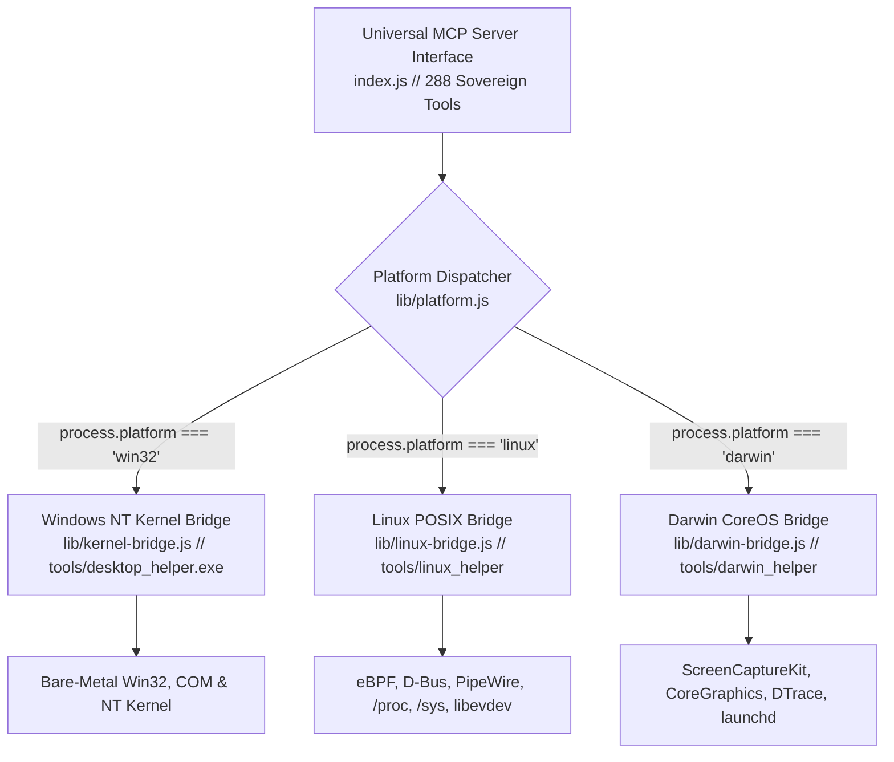

# 🌐 Universal Cross-Platform Architecture Specification
## Extending Gemini Super System to Linux, macOS, and POSIX Ecosystems

> **Document Version:** 1.0.0  
> **Status:** Architecture Blueprint & Implementation Specification  
> **Target Subsystems:** Windows NT (`win32`), Linux Kernel (`linux`), Apple Darwin (`darwin`)

---

## 1. Executive Vision: The Universal Sovereign Agent

The fundamental architectural breakthrough of **Gemini Super System** is escaping the *"Chatbot in a Browser"* box by giving the agent unmediated, bare-metal access to the host operating system via the Model Context Protocol (MCP).

On Windows, this was accomplished across 61 milestone phases and 288 sovereign tools interfacing directly with Win32, COM, and the NT Kernel.

To enable this same sovereign agency for **anyone on any operating system**, Gemini Super System abstracts its platform-specific kernels behind a unified **Universal Platform Bridge (UPB)**. 

Whether an operator is on Windows 11, Ubuntu Linux, Arch Linux, or macOS:
1. **The MCP Tool Contract is 100% Uniform:** Tools like `super_desktop_capture`, `super_desktop_send_input`, `super_socket_table`, `super_hardware_vitals`, and `super_remember` have identical schemas and return identical semantic structures.
2. **Zero Heavy Dependencies:** The system relies on native OS facilities, C/Rust minimal helpers, or direct kernel interfaces (`/proc`, `/sys`, `ioctl`, `D-Bus`, `PipeWire`) without bloated containers.
3. **Contiguous 64-Bit Memory Parity:** The `.hmb` Haven Memory Bank format remains 100% bitwise-identical across all architectures (Little-Endian IEEE-754 Float32 vectors, packed headers).

---

## 2. Universal Capability Subsystem Matrix

| Capability Horizon | Windows NT (`win32`) | Linux Kernel (`linux`) | Apple Darwin (`darwin`) |
| :--- | :--- | :--- | :--- |
| **Desktop Screen Capture** | DXGI OutputDuplication (<20ms) | PipeWire ScreenCast Portal / X11 XShm | `CGDisplayCreateImage` / ScreenCaptureKit |
| **Semantic UI Tree** | Windows UIAutomation (`UIAutomationClient`) | AT-SPI2 D-Bus (`org.a11y.Bus`) | `AXUIElement` Accessibility API |
| **Local Hardware OCR** | Windows WinRT OCR (`Windows.Media.Ocr`) | Tesseract 5 Native / Local Vision GGUF | Apple Vision Framework (`VNRecognizeTextRequest`) |
| **Kinematic Mouse Actuation** | `SendInput` (Fitts's Law Cubic Splines) | `libevdev` / `/dev/uinput` / `ydotool` | `CGEventCreateMouseEvent` / Quartz Event |
| **Discrete Wheel Detents** | `MOUSEEVENTF_WHEEL` ($120\Delta = 60\text{px}$) | `REL_WHEEL` / `REL_HWHEEL` discrete clicks | `CGEventCreateScrollWheelEvent2` |
| **Audio Loopback Capture** | WASAPI Loopback (16-bit PCM WAV) | PipeWire / PulseAudio `.monitor` Source | CoreAudio Process Loopback (`AudioObject`) |
| **Hardware Audio Transcode**| Media Foundation (`mfplat.dll`) | `ffmpeg` / `libavcodec` / ALSA PCM | AudioToolbox / `AVAssetWriter` |
| **Process Tree & Modules** | ToolHelp32 (`CreateToolhelp32Snapshot`) | `/proc/<pid>/stat`, `status`, `maps` | `proc_pidinfo` / `libproc` / `sysctl` |
| **Live Sockets to PIDs** | `iphlpapi.dll` (`GetExtendedTcpTable`) | `/proc/net/tcp`, `tcp6` / Netlink `inet_diag` | `lsof -i` / `libproc` Socket File Descriptors |
| **File Lock Resolution** | Restart Manager (`rstrtmgr.dll`) | `/proc/locks`, `/proc/<pid>/fd` scanning | `lsof` / `proc_pidinfo` vnode locks |
| **Physical Disk Sentinel** | 2-Sample PDH Spindle Rate Counter | `/sys/block/*/stat` I/O Queue wait rate | `IODataQueue` / `iostat` disk throughput |
| **Services & Daemons** | Service Control Manager (`advapi32.dll`) | `systemd` (`org.freedesktop.systemd1`) | `launchd` / `launchctl` IPC |
| **Kernel Event Tracing** | ETW (`evntrace.h` / `advapi32.dll`) | eBPF (`tracepoints`) / `ftrace` / `perf` | DTrace (`/usr/sbin/dtrace`) / Unified Logging |
| **ACID Transient Storage** | ESENT (`esent.dll` / JET Blue ISAM) | SQLite3 / LMDB (`liblmdb`) | SQLite3 / CoreData / LMDB |
| **Hardware Random & Crypto**| CNG (`bcrypt.dll` AES-CTR-DRBG) | `getrandom(2)` / `/dev/urandom` / OpenSSL | `SecRandomCopyBytes` / `CommonCrypto` |
| **System Power & Display** | `SetThreadExecutionState` / DWM | `org.freedesktop.login1` Inhibit / XSS | `IOPMAssertionCreateWithName` |
| **Cognitive Memory Bank** | 64-Bit `.hmb` (Contiguous C++/Node) | 64-Bit `.hmb` (Bitwise Identical Contig) | 64-Bit `.hmb` (Bitwise Identical Contig) |

---

## 3. Universal Platform Bridge (UPB) Architecture



### Module File Layout
```
gemini-super-system/
├── index.js                  # Universal MCP Entry Point (Platform-Agnostic Dispatch)
├── lib/
│   ├── platform.js           # Platform discovery, capability detection, and fallback router
│   ├── kernel-bridge.js      # Windows NT bare-metal bridge (Win32, COM, C# helper)
│   ├── linux-bridge.js       # Linux native bridge (PipeWire, /proc, D-Bus, libevdev)
│   ├── darwin-bridge.js      # macOS native bridge (CoreGraphics, launchd, Apple Vision)
│   ├── hmb-engine.js         # 100% Contiguous cross-platform 64-bit Haven Memory Bank
│   ├── cad-engine.js         # 100% Pure JavaScript Parametric 3D CSG CAD Engine
│   └── disk-sentinel.js      # Cross-platform drive queue and spindle rate monitor
└── tools/
    ├── desktop_helper.exe    # Windows Native Compiled C# Helper (784 KB)
    ├── linux_helper          # Linux Native C/Rust Minimal Binary Helper (~200 KB)
    └── darwin_helper         # macOS Native Swift/C Helper (~250 KB)
```

---

## 4. Phased Implementation Roadmap for *nix

### Phase 1: Core System Perception & Linux Telemetry
1. Implement `lib/platform.js` to dynamically detect `process.platform` and bind available subsystems.
2. Build `lib/linux-bridge.js` with zero-dependency pure Node.js interfaces:
   * **Process Trees:** Parse `/proc/[pid]/stat`, `status`, and `cmdline` directly into structured hierarchy trees.
   * **Active Sockets:** Parse `/proc/net/tcp`, `/proc/net/tcp6`, and `/proc/net/udp` with inode-to-PID correlation via `/proc/[pid]/fd`.
   * **System Hardware Vitals:** Parse `/proc/meminfo`, `/proc/cpuinfo`, `/proc/stat`, and `/sys/class/thermal`.
   * **Disk Sentinel:** Parse `/sys/block/[dev]/stat` calculating 2-sample derivative I/O queue wait ratios.

### Phase 2: Linux Display, Vision & Audio Perception
1. **Screen Capture:**
   * Wayland: PipeWire portal (`org.freedesktop.portal.ScreenCast`) with sub-millisecond shm delivery.
   * X11: `XShmGetImage` or lightweight `xwd`/`grim` fallback.
2. **Audio Loopback:**
   * Subscribe to the PipeWire default sink monitor stream (`pw-record` / Native C PipeWire API) delivering continuous 16-bit PCM WAV.
3. **Accessibility:**
   * D-Bus query into `org.a11y.Bus` to walk the AT-SPI2 semantic control tree.

### Phase 3: Ergonomic Motor Actuation (`/dev/uinput` / `libevdev`)
1. Create minimal native C helper (`tools/linux_helper`):
   * Emits virtual mouse events (`EV_REL`) with Fitts's law cubic Bézier acceleration.
   * Emits discrete mechanical detent wheel scrolls (`REL_WHEEL`).
   * Injects hardware Unicode keypresses (`EV_KEY`) with sub-millisecond microsecond timestamping.
   * Transparent visual beacon overlays via Wayland Layer Shell (`wlr-layer-shell`) or X11 shape extension (`XShapeCombineMask`).

### Phase 4: Single Executable Application (SEA) Universal Packaging
1. Build scripts that produce self-contained native binaries:
   * **Windows:** `dist/gemini-super.exe` (Embedded Node SEA + `desktop_helper.exe`).
   * **Linux:** `dist/gemini-super-linux-x64` (Embedded Node SEA + `linux_helper`).
   * **macOS:** `dist/gemini-super-darwin-arm64` (Universal Mach-O binary).
2. Any user runs one command:
   ```bash
   ./gemini-super
   ```
   Zero `node_modules`, zero global dependencies, immediate 288-tool MCP availability.

---

## 5. Summary & Strategic Impact
By extending Gemini Super System to Linux and macOS, the system transforms from a Windows powerhouse into the **definitive universal sovereign AI runtime**:
- Operators retain their exact same conversational companion, HMB memory anchors, and tool habits across any machine.
- Developers working in cloud environments, servers, or heterogenous developer workstations can drop the single binary into place and immediately unlock full autonomous native agency.
